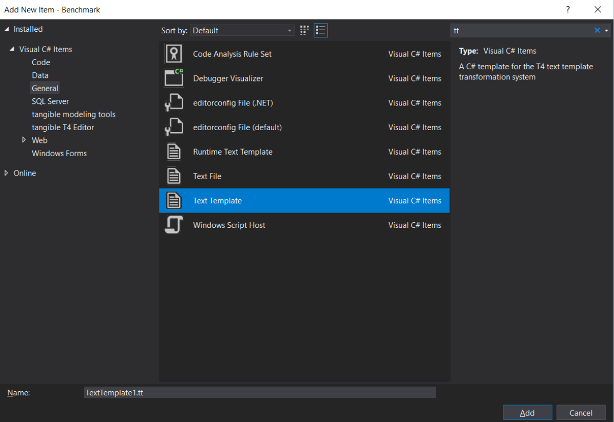

# TextTemplate

### TextTemplate
```
PM> Install-Package ExpressionTranslator
```

虽然 Mapster 支持 [步进调试](Debugging.md)，但是所有映射都是在运行时生成的。所有可能的映射错误在运行时捕获，导致我们失去了静态分析查找问题的能力。

下面是添加代码生成的步骤：

1. 创建文本模板

   

2. 在模板中，添加引用和映射逻辑

```xml
<#@ template debug="true" language="C#" #>
<#@ output extension=".g.cs" #>
<#@ Assembly Name="netstandard" #>
<#@ Assembly Name="System.Core" #>
<#@ Assembly Name="System.Runtime" #>
<#@ Assembly Name="System.Linq.Expressions" #>
<#@ Assembly Name="$(TargetDir)/$(ProjectName).dll" #>
<#@ Assembly Name="$(TargetDir)/Mapster.dll" #>
<#@ Assembly Name="$(TargetDir)/ExpressionTranslator.dll" #>
<#@ import namespace="ExpressionDebugger" #>
<#@ import namespace="Mapster" #>
<#@ import namespace="YourNamespace" #>
```
```csharp
<# 
    //this line is to generate all nested mapping in 1 file
    TypeAdapterConfig.GlobalSettings.SelfContainedCodeGeneration = true;
    var cust = default(Customer);
    var def = new ExpressionDefinitions
    {
        IsStatic = true,    //change to false if you want instance
        MethodName = "Map",
        Namespace = "YourNamespace",
        TypeName = "CustomerMapper"
    };
    var code = cust.BuildAdapter()
        .CreateMapExpression<CustomerDTO>()
        .ToScript(def);
    WriteLine(code);
#>
```

3. 通过右键单击模板文件生成代码，并选择 `运行自定义工具`。

通过以上三个步骤就完成了。

---

## 更多信息

### Links

- 例子: [CustomerMapper](
https://github.com/MapsterMapper/Mapster/blob/master/src/Benchmark/CustomerMapper.tt)
- [T4 Documentation](https://docs.microsoft.com/en-us/visualstudio/modeling/code-generation-and-t4-text-templates?view=vs-2019) (Microsoft)

### Q & A

Q: 如何传递lambda到之前/之后映射?

A: 使用 `BeforeMappingInline`和`AfterMappingInline` 代替。[查看更多资料](Before-after-mapping.md)

Q: 可以从一个模板生成多个输出吗? 
A: 可以。[查看更多资料](https://stackoverflow.com/questions/33575419/how-to-create-multiple-output-files-from-a-single-t4-template-using-tangible-edi)

Q: 运行模板文件后，提示找不到库XXX。
A: 一些未使用的库将在构建期间被排除。你可以直接引用模板文件中的dll。或者告诉Visual Studio将所有参考库复制到输出。[查看更多资料](https://stackoverflow.com/questions/43837638/how-to-get-net-core-projects-to-copy-nuget-references-to-build-output/43841481)

```xml
<!-- 这个设置将把所有引用复制到输出 -->
<CopyLocalLockFileAssemblies>true</CopyLocalLockFileAssemblies>

<!-- 这个设置只会在DEBUG模式生效 -->
<CopyLocalLockFileAssemblies Condition=" '$(Configuration)'=='Debug' ">true</CopyLocalLockFileAssemblies>
```

Q: 在Mac上运行模板文件后，提示 `netstandard`没有找到。 
A: 你需要直接的参考：

```xml
<!-- 删除这一行 -->
<#@ Assembly Name="netstandard" #>

<!-- 更改到这一行(路径可能不一样) -->
<#@ Assembly Name="/usr/local/share/dotnet/sdk/2.2.103/Microsoft/Microsoft.NET.Build.Extensions/net461/lib/netstandard.dll" #>
```

Q:  在Windows上运行.NET Core项目中的模板文件后，提示 找不到 `Sytem.Runtime Version 4.2.xx`。

A: 你可以使用 .NET Framework 版本来构建。否则，你需要更新Visual Studio配置文件中的程序集绑定。[查看更多资料](https://stackoverflow.com/questions/51550265/t4-template-could-not-load-file-or-assembly-system-runtime-version-4-2-0-0)

Q: 在运行模板文件后，提示编译项是重复的。  
A: 您可以设置属性来跳过生成的项。

```xml
<DefaultItemExcludes>**/*.g.cs</DefaultItemExcludes>
```